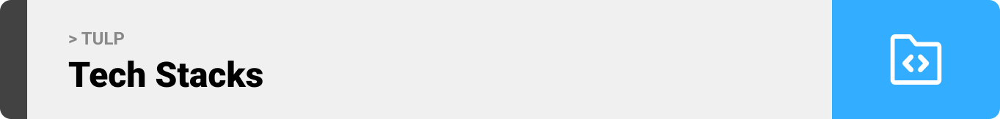

<br><br>

<!-- project philosophy -->

<br><br>

> A Web app for teaching and taking online classes, making it easier for people to get or give knowledge online.
>
> TULP aims to make the ultimate e-learning platform by providing a user-friendly interface that makes learning simple with no extra complications. We believe in enhancing the learning experience so that instructors can focus on instructing and students can focus on learning.

### User Stories

#### Instructor

- As an instructor, I want to communicate with others on the same platform so that I don't have to download or use extra applications.
- As an instructor, I want to have an online classroom with video and screensharing functionality so that I can enhance my way of teaching.
- As an instructor, I want to have an online collaborative compiler so that I can provide a better learning experience.

#### Studnet

- As a student, I want to join an online class so that I can study more effectively.
- As a student, I want to have easy-to manage class information so that I can focus on my studies more.
- As a student, I want to directly message instructors so that I can ask questions easily.

#### Admin

- As an admin, I want to see website stats so that I can reflect on them and act accordingly.
- As an admin, I want to see website users so that I can easily manage them.
- As an admin, I want to be able to delete classes so that I can manage website content.

<br><br>

<!-- Tech Stacks -->


### TULP is built using the following technologies:

- This website is built with [Vite](https://vitejs.dev), with its fast HMR (hot model replacement), optimized build, and instant server start for a faster developer experience.
- This website uses [React Router v6.21](https://reactrouter.com/en/6.21.3/start/overview), for robust routing and access to the data API.
- To send messages in real time, the app uses the [Socket.IO](https://socket.io). a library that enables low-latency, bidirectional, and event-based communication between a client and a server.
- The app uses [electron-vite](https://electron-vite.org) for the administrative side. Electron enables building desktop applications with web libraries and frameworks; here we used electron to build a desktop app with React.

<br><br>

<!-- UIUX -->


> We designed TULP using wireframes and mockups, iterating on the design until we reached the ideal layout for easy navigation and a seamless user experience.

- Project Figma design [figma](https://www.figma.com/file/XuTAPH2g4wbANsYssTglXT/Final-Project?type=design&node-id=3%3A3&mode=design&t=oafDRs7DoD5WRtMv-1)

### Mockups (Desktop)

| Log In Page                          | Home Page                                       |
| ------------------------------------ | ----------------------------------------------- |
|  |          |
| Chatting                             | Class Page                                      |
|    |  |

<br><br>

<!-- Database Design -->

<br><br>

### Architecting Data Excellence: Innovative Database Design Strategies:


<br><br>

<!-- Implementation -->


### User Pages (Web)

| Landing Page                                     | Register Page                              |
| ------------------------------------------------ | ------------------------------------------ |
|        |        |
| Home Page                                        | Class Page                                 |
|           |     |
| Class Settings                                   | Create a Class                             |
|              |    |
| Add Schedule                                     | Class Settings                             |
|  |        |
| Chatting                                         | Hair Check Page                            |
|              |  |
| Video Chatting                                   | Collabrative Compiler                      |
|         |        |

| Real Time Collabrative Coding |
|  |

### Admin Panel (Desktop)

| Login                                    | Dashboard                                |
| ---------------------------------------- | ---------------------------------------- |
|  |  |
| Manage Users                             |
|       |

<br><br>

<!-- AWS Deployment -->


### Commands used to deploy this project on an EC2 server

- Start superuser

```sh
sudo su
```

- Install node.js

```sh
curl -o- https://raw.githubusercontent.com/nvm-sh/nvm/v0.34.0/install.sh | bash
. ~/.nvm/nvm.sh
nvm install node
```

- Install mongodb

  - Make mongodb-org-7.0.repo file

  ```sh
  cd /etc/yum.repos.d
  touch mongodb-org-7.0.repo
  vi mongodb-org-7.0.repo
  ```

  - Copy paste this text in it

  ```txt
  [mongodb-org-7.0]
  name=MongoDB Repository
  baseurl=https://repo.mongodb.org/yum/amazon/2023/mongodb-org/7.0/x86_64/
  gpgcheck=1
  enabled=1
  gpgkey=https://pgp.mongodb.com/server-7.0.asc
  ```

  - Enter this command to install.

  ```sh
  sudo yum install -y mongodb-org
  ```

- Now clone project files

```sh
cd /home/ec2-user
git clone https://github.com/AliHakim773/TULP.git
```

<br><br>

<!-- Unit Testing -->


- Testing APIs and features plays an essential role in development since it makes bug-catching and avoiding mistakes easier. That is why TDD (test-driven development) is a really popular approach that helps catch problems early in the development phase.
- Although I didn't use the TDD approach, I implemented tests on some APIs to automate the testing process.

##### Here is the result of the tests


##### This is the code of one of the tests

```js
it("testing get class schedule with incorrect slug ", async () => {
  const authResponse = await request(app)
    .post("/auth/login")
    .send({ username: "saif", password: "password" })

  const token = authResponse.body.token

  const response = await request(app)
    .post("/class/sef-ui-ux-design-bootcamp/assignment")
    .send({ title: "tester", content: "test" })
    .set("Authorization", `Bearer ${token}`)

  expect(response.status).toBe(200)
})
```

<br><br>

<!-- How To Run -->

<br><br>

> To set up TULP locally, follow these steps:

### Prerequisites

- npm
  ```sh
  npm install npm@latest -g
  ```
- Download [mongoDB](https://www.mongodb.com/docs/manual/tutorial/install-mongodb-on-windows/)

### Installation

1. Get a free Glot API Key at [https://glot.io](https://glot.io/account/token).
2. Get a free Daily.co API Key at [https://docs.daily.co](https://docs.daily.co/guides/create-and-manage-rooms-with-the-rest-api).
3. Clone the github repository
   ```sh
   git clone https://github.com/AliHakim773/TULP.git
   ```
4. Setup the frontend.

- Open the terminal from the tulp-frontend directory then

  ```sh
  npm install
  ```

- Then go to .env.example file, rename it to .env and edit it as shown.

  ```.env
  VITE_DAILY_API_KEY="Your dailyco api key"
  ```

- If the server is no longer on aws then change VITE_BASE_URL

  ```.env
  VITE_BASE_URL=http://localhost:8000/
  ```

5. Setup your electron

- Open the terminal from the admin-panel directory then

```sh
npm install
```

- If the server is no longer on aws then change VITE_BASE_URL

```.env
VITE_BASE_URL=http://localhost:8000/
```

6. Setup the backend. (In case the website is no longer on aws or if you want to test it)

- Open the terminal from the tulp-backend directory then

  ```sh
  npm install
  ```

Then go to .env.example file, rename it to .env populate the values.

```.env
GLOT_API_KEY="Your Glot api key"
JWT_SECRET="Your Secret JWT key (Can be what ever you want)"
```

7. Now all left is to run the project.

- From the tulp-frontend directory open terminal and run

```sh
npm start
```

- From the admin-panel directory open terminal and run

```sh
npm start
```

- From the tulp-backend directory open terminal and run (if you want to use it locally)

```sh
npm seeder/seeder.js
npm start
```

Now you your TULP platform is up and running, enjoy.
