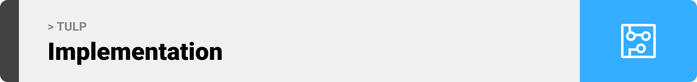

<br><br>

<!-- project philosophy -->

<br><br>

> A Web App for teaching and taking online classes, making it easier for people to get/give knowlage online.
>
> TULP aims to make the ultimate E-learning platform by providing a user-friendly interface that makes learning simple with no extra complications. We believe in enhancing the learning experience so that instructors can focus on instructing and students can focus on learning.

### User Stories

#### Instructor

- As an Instructor I want to communicate with others on the same platform, so that I don't have to downloads/use extra application.
- As an Instructor I want to have an online classroom with video and screensharing functionality, so that I can enhance my way of teaching.
- As an Instructor I want to have an online collabrative compiler, so that I can give a better learning experience.

#### Studnet

- As a student I want to join an online class, so that I can study more effectively.
- As a student I want to have an easy to manage class information, so that i can focus on my studies more.
- As a student I want to directly message instrctors, so that I can ask questions easily.

#### Admin

- As an admin I want to see website stats, so that I can reflect on them and act accordingly.
- As an admin I want to see website users, so that I can easily manage the users.
- As an admin I want be able to delete classes, so that I can manage website content.

<br><br>

<!-- Tech Stacks -->


### TULP is built using the following technologies:

- This website is build with [Vite](https://vitejs.dev), with its fast HMR (Hot Model Replacment), optimized build, and Instant Server Start, for faster developer experience.
- This website uses [React Router v6.21](https://reactrouter.com/en/6.21.3/start/overview), for a robost routing and an access to the dataAPI.
- To send messages in real time, the app uses the [Socket.IO](https://socket.io). Which a library that enables low-latency, bidirectional and event-based communication between a client and a server.
- The app uses [electron-vite](https://electron-vite.org) for the adminestrative side, electron enables building desktop applications with web libraries and frameworks, here we used electron to build a desktop app with react.

<br><br>

<!-- Implementation -->


> We designed TULP using wireframes and mockups, iterating on the design until we reached the ideal layout for easy navigation and a seamless user experience.

- Project Figma design [figma](https://www.figma.com/file/XuTAPH2g4wbANsYssTglXT/Final-Project?type=design&node-id=3%3A3&mode=design&t=oafDRs7DoD5WRtMv-1)

### User Screens (Web)

| Login screen                              | Register screen                         | Landing screen                          | Loading screen                          |
| ----------------------------------------- | --------------------------------------- | --------------------------------------- | --------------------------------------- |
|  |  |  |  |
| Home screen                               | Menu Screen                             | Order Screen                            | Checkout Screen                         |
|  |  |  |  |

### Admin Screens (Desktop)

| Login screen                            | Register screen                       | Landing screen                        |
| --------------------------------------- | ------------------------------------- | ------------------------------------- |
|  |  |  |
| Home screen                             | Menu Screen                           | Order Screen                          |
|  |  |  |

<br><br>

<!-- Database Design -->

<br><br>

### Architecting Data Excellence: Innovative Database Design Strategies:

<br><br>

<!-- Implementation -->

  <br><br>

<!-- AWS Deployment -->


### Efficient AI Deployment: Unleashing the Potential with AWS Integration:

- This project leverages AWS deployment strategies to seamlessly integrate and deploy natural language processing models. With a focus on scalability, reliability, and performance, we ensure that AI applications powered by these models deliver robust and responsive solutions for diverse use cases.
  <br><br>

> To set up TULP locally, follow these steps:

### Prerequisites

This is an example of how to list things you need to use the software and how to install them.

- npm
  ```sh
  npm install npm@latest -g
  ```
- Download [mongoDB](https://www.mongodb.com/docs/manual/tutorial/install-mongodb-on-windows/)

### Installation

1. Get a free Glot API Key at [https://glot.io](https://glot.io/account/token). This is used to help with video chatting.
2. Get a free Daily.co API Key at [https://docs.daily.co](https://docs.daily.co/guides/create-and-manage-rooms-with-the-rest-api). This is used for compiling code.
   ```sh
   git clone https://github.com/AliHakim773/TULP.git
   ```
3. Setup the backtend.
   ```sh
   cd tulp-backend
   npm install
   ```
   Then go to .env.example file, rename it to .env populate the values.
   ```.env
   GLOT_API_KEY="Your Glot api key"
   JWT_SECRET="Your Secret JWT key (Can be what ever you want)"
   ```
4. Setup the frontend.
   ```sh
   cd ../tulp-frontend
   npm install
   ```
   Then go to .env.example file, rename it to .env populate the values.
   ```.env
   VITE_DAILY_API_KEY="Your dailyco api key"
   ```
5. Setup your electron
   ```sh
   cd ../admin-panel
   npm install
   ```
6. To run TULP you need to run the backend from the backend directory with npm start, then the frontend and electron also with npm start

Now, you should be able to run TULP locally and explore its features.
